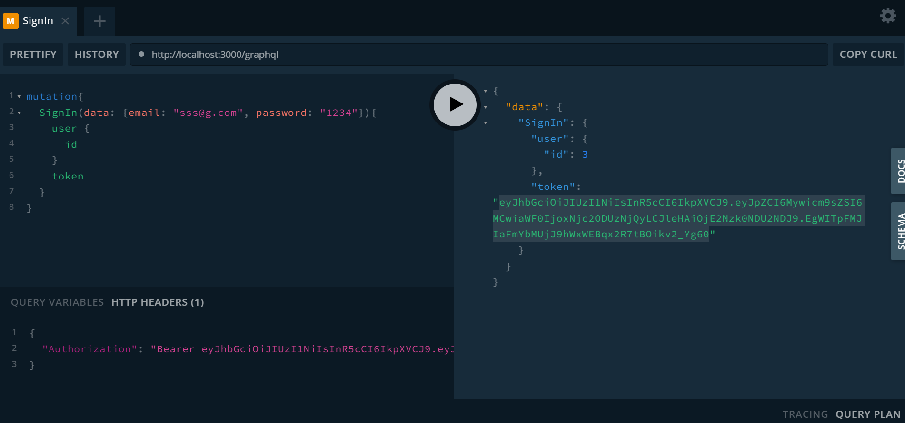

# Library System

Simple & Minimal Microservice Library Application.

## Prerequisites

- Docker

## Usage

1. Clone this repository to your local machine.
2. Open a terminal window and navigate to the root directory of the repository.
3. Run `docker-compose up`.
4. Access the application at `http://localhost:3000`.

## Documentation

The API documentation is available on the playground at `http://localhost:3000/graphql`.
You can explore the schema, make queries and mutations.

@Important
There are two default user with admin role:
AdminUser1 => email: admin1@g.com password: admin
AdminUser2 => email: admin2@g.com password: admin

## Technologies Used

- NestJS
- GraphQL
- PostgreSQL
- RabbitMQ
- Docker
- Redis
- Bull